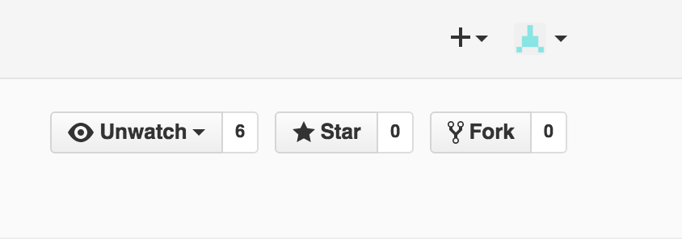
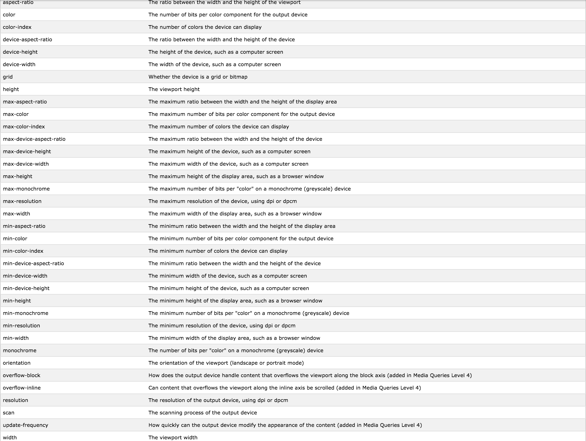
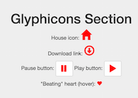
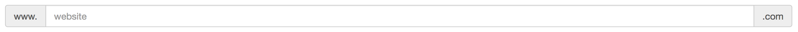
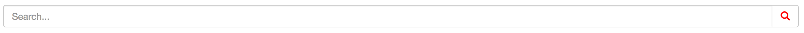
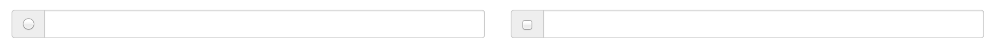

#Bootstrap and Transition Workshop
##CS52 16X
###Presenters: Jessie Anderson, Manmeet Gujral, Alex Beals, Jean Zhou, Emma Oberstein, Rob Sayegh
###Date: June 30, 2016
---
###Setup

To set up for the tutorial, fork this repository by clicking the "fork" button in the upper right corner of the page:



Now, you have a copy of your repository in your own github account.

Switch to the `gh-pages` branch so that you will be able to see your page update as you complete the tutorial. Clone the repository in the command line and make sure you are on the `gh-pages` branch (run the command `git branch` to see what branch you're on, and if you're not on `gh-pages`, run `git checkout gh-pages`).

Note the directory structure: you'll be working with the files in `tutorial/`, which contains a template `index.html` and `css/main.css` for you to modify where we have marked with comments. Our example code is in the directory `example/`, which is a possible end product to this tutorial.

Now you're ready to start modifying files!

---
###Section 1: Bootstrap grid
Now that you understand the grid system and its purpose, let’s implement it to create a grid of images and/or text.

To begin, let’s create a create a container for our grid with the following code:

```html
<div class="container">
</div>
```

Our container will hold all the rows and columns for our grid, so let’s create a row nested within our container, with the following line of code:
```html
<div class="row">
</div>
```
So now we have a row to work with within our container, so let’s create a column that contains an image of a nice little puppy, like this:
```html
<div class="col-lg-3 col-md-4 col-xs-6 thumb">
	<a class="thumbnail" href="#">
		
	</a>
</div>
```
Some things to note about the above code:
The line
```html
<div class="col-lg-3 col-md-4 col-xs-6 thumb">
```

creates a column that takes up 3 blocks on a large screen, 4 blocks on a medium screen, and 6 blocks on a small screen. As you know, the bootstrap grid is made up of 12 total blocks, so this line determines what fraction of the screen you are working with.
The code following that is to use an image that links to nothing, you can simply copy that format if you would like to use images from the web!

__NOTE:__

	href="#"

means that clicking your images links to nothing. Try and focus on the grid!

Now that you know how to create a container, row, and column, try and add three extra rows of a varied number of columns to create a grid of images and text that demonstrates the power of the bootstrap grid for clean web design.

Check out this page for some more specific info on the nuances of the bootstrap grid: http://getbootstrap.com/css/#grid

---
###Section 2: Buttons

Let’s add in some buttons. To begin, let’s add in the following code:

```html
<button type="button" class="btn"> A Primary Button</button>
```

This is a primary button. In Bootstrap, there are six predefined styles: primary, secondary, success, info, warning, danger and link. To add in these styles, simply add the class ``btn-<style>`` (i.e. btn-info).

So let’s make our original button a primary button.

We can also change the size of our buttons by adding in the classes ``btn-lg`` or ``btn-sm``.

Let’s add in a large secondary button, a regular success button and a small info button.

We can disable our buttons by adding in the disabled property.  

Let’s add in a disabled warning button.

In a new row, let’s add in a danger button with the class btn-block. This will ensure the button spans the entire width of its parent element.

Bootstrap also allows us to group our buttons together using button groups. Let’s add in a basic example:

```html
<div class="btn-group" role="group" aria-label="...">
  <button type="button" class="btn btn-default">Left</button>
  <button type="button" class="btn btn-default">Middle</button>
  <button type="button" class="btn btn-default">Right</button>
</div>
```

We can change the size of the group by adding in the class ``btn-group-<size>``.
We can use a button toolbar to group together multiple button groups.

Let’s try changing the group size or creating a button toolbar.

Bootstrap also allows us to easily add in button dropdown menus via nesting.
Let’s add in an example in the next row of what a dropdown button menu could look like:

```html
<div class="btn-group" role="group">
    <button type="button" class="btn btn-default dropdown-toggle" data-toggle="dropdown" aria-haspopup="true" aria-expanded="false">
      Dropdown
      <span class="caret"></span>
    </button>
    <ul class="dropdown-menu">
      <li><a href="#">Dropdown link</a></li>
      <li><a href="#">Dropdown link</a></li>
    </ul>
  </div>
```
Customize it to make it your own!

---
###Section 3: Transitions and Animations

In this tutorial, we’ll make one transition and one animation (the sample solution has more, and you can make more if you like). The grid is already set up in `index.html`; take a look at the `<!-- Transitions and Animations -->` section of `index.html` to see the setup.

The first `<div>` in this section will be a transition. Now open `css/main.css` and find the section that looks like this:

```css
/******** transition/animation style section ********/

#transition {
  /* put style here */
}

#transition:hover {
  /* what do you want the transition to do? */
}

#animation {
  /* put "initial" style of animation here */
  animation-name: keyanimate;
}

@keyframes keyanimate {
  /* What do you want your animation to do? */
}

/*************************************************/
```

Since the ID of the first `<div>` is `transition`, you'll be working on the first 2 selectors first. The selector `#transition` will specify the "normal" state of the object (size, color, etc.). You'll need to give it values for `transition-property` (the easiest value is “all”), `transition-duration` (i.e. `1s`, `2s`, etc.) , and (optionally) `transition-timing-function` (some fun ones are `ease-in`, `ease-out`, and `ease-in-out`). If you want your div centered, use the line `margin: 0 auto;`.

Now you need to write the selector `#div:hover`. Whatever you put in here will be the state of the object when you hover your mouse over it. The transition between the “normal” and “hovering” state of the object will occur in the time period specified by `transition-duration`, and with the timing specified by `transition-timing-function`. Again, make this whatever you want. Some cool things you can do are change the color of the object, make it grow, and make it rotate or skew using transform.

Now let’s make an animation using the second div. Animations are different from transitions because they happen without the user performing any action with the mouse. Use the third selector, `#animation`, to specify the initial state of the object (as with transitions).

Now, you need to add at least 2 values to the selector: `animation-name` and `animation-duration`. `animation-name` has already been chosen for you, and a keyframes rule `@keyanimate` is set up for you to fill in. `animation-duration` is the length of the animation (i.e. `1s`, `2s`, etc.).

**Keyframes rule**

The animation is specified using the `keyframes` rule. This is basically another selector with the syntax `@keyframes animation-name {keyframes-selector {css styles}}`. The `keyframes-selector` can either be a percentage 0-100% (what you want the animation to look like at a certain moment in the animation) or the keywords `from` and `to`. Here are two examples using each of these possibilities (with `animation-name: colorchange;`):

```css
@keyframes colorchange {
	from{background-color:blue}
	to{background-color:green}
}
```
Or, if the background-color specified in `#animation{}` is blue, then the following would accomplish the same thing:

```css
@keyframes colorchange {
	to{background-color:green}
}
```
Using percents (this does something different):

```css
@keyframes colorchange {
	0% {background-color:blue}
	50% {background-color:purple}
	100%: {background-color:green}
}
```
**Animation duration and repetition**

Add the field `animation-iteration-count` if you want your animation to repeat itself; `infinite` is an option. Other fields you can add are `animation-direction` and `animation-delay`. `animation-direction` specifies which direction you want the animation to run in (reverse, alternate, etc.), and `animation-delay` specifies an amount of time you want to wait before starting the animation.

Note: guidance taken from [w3schools](http://www.w3schools.com/cssref/) CSS and CSS3 tutorials.

---
###Section 4: Media Queries

Media queries are used in Bootstrap to make the columns you created above change positions on the screen depending on the screen size. They can be used not just for this purpose, but to modify any CSS property of an element on the page. You can implement a media query using the following syntax:

```css
@media not|only mediatype and (media feature) {
    /* Standard css code goes here and will be applied
    when the condition is met. */
}
```
Use "not" or "only" depending on whether you'd like to apply the styling when the stated condition exists, or when it does not exist.

The mediatype is the first major component of the media query. It is the first condition that must be met (or not met if using not). It can take on any of 4 parameters. You can use "print" to have content display differently when being printed, "screen" for when it is being displayed on screen, "speech" for when a screenreader is reading the page out loud to, say a disabled person, or "all" meaning all of the above. There are also many deprecated types that we will not discuss here.

The media feature is the other major part of the media query, the second condition that must be met. You can continue to concatenate more media features using that and statement can take be any of the following:


via [W3 Schools](http://www.w3schools.com/cssref/css3_pr_mediaquery.asp)

Using the HTML template, set up a three column grid in the media queries section with any content you would like. You may use columns of different sizes, but make sure that the sum of your bootstrap columns is 12! Use the first row ```(id="row1")``` for this grid.

Now add a media query in the style tags above that will modify any one or multiple css properties that you wish, given a condition set from the lists above. It will probably be easiest to do so with mediatype "screen" and media feature ```max-width``` or ```min-width``` as these are the easiest to test quickly in the browser in my experience.

Good coding practice is to build for mobile first, meaning your default css should be for as it will look good on all screen sizes, and your media query should alter it for the larger screen sizes. If you are using ```min-width```, you built for desktop first. Good coding practice dictates that you should use ```max-wdth``` instead, reversing your default and media queried CSS. Go ahead and make this change, if neccessary, now.

Try adjusting the size of your window (or whatever property you chose to play with now, and check to make sure the media query is working.

Next, as a challenge, you are going to change an image based on the size of the window. In our example, we changed the image from a MacBook to a Smartphone based on the screen size. Without looking at the example code, try to think about how you would do this using just a media query and CSS. Look at a list of CSS properties [here](http://www.pageresource.com/dhtml/cssprops.htm) and try to find one you can use to do this. You will also need to use some HTML tags in your code to apply the CSS styles to.


---
###Section 5: Glyphicons

Bootstrap comes with over 250 [glyphicons](http://glyphicons.com/), one of many cool features built into Bootstrap. These are monochromatic icons and symbols intended for simplicity and ease of use. Rather than using an image, these icons are incredibly robust and flexible. They are easily incorporated into text, buttons, forms, etc.

Glyphicons are inserted using code in the following format:
`<span class="glyphicon glyphicon-NAME"></span>`

Go to [this link](http://getbootstrap.com/components/) to see a list of available icons under the Glyphicons section. Select one you like, use its appropriate name, and insert it into your page.

To make something more interesting, let’s create a button that is a link. Find the glyphicon that looks like a download link and add it to your page as a link (This does not need to actually link anywhere). Remember that a link is created with the code:
`<a href="#"></a>`

Now, combine your knowledge of buttons with glyphicons to create a button with an icon on it. Specifically, try to create a “play button” and “pause button” (They do not need to actually do anything).

These icons are a bit small though, aren’t they? Luckily, we can manipulate the size of these icons. To do so, we may treat them like any component with css. Go to `main.css` and change the size of the glyphicons class to enlarge them from their default size to twice its default. While we’re at it, let’s change their color to red.

Now let’s place a star glyphicon in the nav bar next to the “Glyphicons” section. See how that looks on the page.

Uh oh! That’s a bit too big to be in the nav bar. To fix this, we want to change the size of just the star icon. Luckily, we can do so by addressing its specific class (`.glyphicon.glyphicon-NAME`). Go to `main.css` and add a section to return the star glyphicon to its default size, while other icons remain larger.

Finally, let’s combine glyphicons with css transitions to make a “beating” heart. Find the heart icon, add it to your page. Use css transitions to have it gradually grow to a larger size when the cursor hovers over it, and then gradually back to its original size when the cursor moves off of it.

Your end product should look similar to:



Perfect! You have now experienced how easy it is to spice up bootstrap pages with glyphicons.

Glyphicons are just one of many additional components and cool features that bootstrap implements for ease of use. Check out the rest of [http://getbootstrap.com/components/](http://getbootstrap.com/components/) to see what else is available.

---
###Section 6: Input Groups

Bootstrap provides further customization options on inputs through input groups. This allows you to group inputs, text, buttons, etc. together simply and elegantly. These features are just another bit of customization provided by bootstrap to make things easier for the coder.

To begin, create an input group class:
`<div class="input-group">
</div>`

Then, we create a text-box input:
`<input type="text" class="form-control" placeholder=“default text here”>`

Now, to add to this input group, we use the class `input-group-addon` inside a `<span>`:

`<span class="input-group-addon”>TEXT</span>`

This addon will appear before or after the input box depending on its position.

To test this out, let’s make an input group for text representing a URL. In the Input Group Section of the html template, there is already an input box beginning with “www.” So your job is simply to add “.com” at the end.

Your result should look similar to this:



Input groups may also have a button addon. Rather than the class `input-group-addon`, the class for buttons is `input-group-bttn`. So let’s combine input groups with what we’ve learned before to create a search bar. In other words, make an input group with a search button glyphicon after the text input box.

If necessary, adjust the size of the search icon. Your result should look similar to this:



Furthermore, input groups may also be combined with checkboxes and radio buttons. Both are treated as the `input-group-addon` class.

The code for a radio button: `<input type="radio">`

The code for a checkbox: `<input type="checkbox">`

Now, combine input groups with the grid system by making a row with two columns. Have one column be the input group with a radio button, and the other be the input group with a checkbox.

Your result should look similar to this:



You have now experienced how bootstrap provides further customization to simple structures such as inputs. Check out the rest of [http://getbootstrap.com/components/](http://getbootstrap.com/components/) to see what else is available.

---
###Section 7: Adding your own section

Bootstrap makes it easy to create navbars.  There's already a navbar set up, but let's create a new section to the navbar, after the Input Section.

The first thing to do is add in a list element to the navbar.

```html
<li>
    <a class="page-scroll" href="#custom">Your Own</a>
</li>
```

The ‘page-scroll’ class is for use with ‘scrollspy’, the Bootstrap plugin that allows the navbar to change the highlighting as you scroll.  The ‘href’ tag is a link to a section with an id of ‘custom’.  However, that section doesn’t exist yet, so while the section will show up in the navbar, clicking on it won’t do anything.  So let’s add in the section!

```html
<section id="custom" class="custom-section">
    <h1>Custom Section</h1>
    <!-- Whatever you want! -->
</section>
```

This section has an id of ‘custom’, matching the link so that the link will actually function, and has a class ‘custom-section’, which can be separately styled in ‘main.css’.  To match, add a section with a min-height of 100%, a top padding of 60px, centrally aligned text, and a background color of either #fff or #eee depending on where you’re inserting the section.

Now it will work!  Feel free to add custom styles to your section, and add whatever you want from the previous sections into this one. If you're feeling particularly ambitious, you can even research and add another cool component of bootstrap that was not discussed here.

---

Source: This tutorial was taken from the template [http://startbootstrap.com/template-overviews/scrolling-nav/](http://startbootstrap.com/template-overviews/scrolling-nav/), and then modified.
